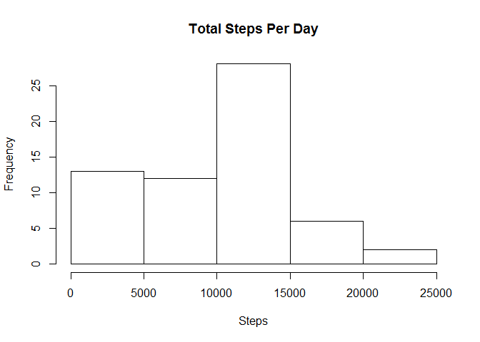

Introduction
------------

It is now possible to collect a large amount of data about personal
movement using activity monitoring devices such as a Fitbit, Nike
Fuelband, or Jawbone Up. These type of devices are part of the
"quantified self" movement - a group of enthusiasts who take
measurements about themselves regularly to improve their health, to find
patterns in their behavior, or because they are tech geeks. But these
data remain under-utilized both because the raw data are hard to obtain
and there is a lack of statistical methods and software for processing
and interpreting the data.

This assignment makes use of data from a personal activity monitoring
device. This device collects data at 5 minute intervals through out the
day. The data consists of two months of data from an anonymous
individual collected during the months of October and November, 2012 and
include the number of steps taken in 5 minute intervals each day.

Loading the Data
----------------

Code to download and read the data into R

    temp <- tempfile()
    download.file("https://d396qusza40orc.cloudfront.net/repdata%2Fdata%2Factivity.zip",temp)
    file <- unzip(temp)
    unlink(temp)
      
    data <- read.csv(file, header = TRUE, sep = ',', colClasses = c("numeric", "character",
                                                                              "integer"))

Process the Data
----------------

Change date format using lubridate

    library(lubridate)
    data$date <- ymd(data$date)

Analyze the Data
----------------

**What is the mean total number of steps taken per day?**

1.Calculate the total number of steps taken per day

    totalsteps1 <- tapply(data$steps,data$date,sum,na.rm=TRUE)

1.  Make a histogram of the total number of steps taken each day

<!-- -->

    hist(totalsteps1, xlab="Steps", main="Total Steps Per Day" )

<!-- -->

3.Calculate and report the mean and median of the total number of steps
taken per day

    mean(totalsteps1)

    ## [1] 9354.23

    median(totalsteps1)

    ## [1] 10395

**What is the average daily activity pattern?** 1.Make a time series
plot (i.e. type = "l") of the 5-minute interval (x-axis) and the average
number of steps taken, averaged across all days (y-axis)

    ##Find average steps per interval
    avgperinterval <- tapply(data$steps,data$interval,mean,na.rm=TRUE)

    ##Create line plot
    plot(row.names(avgperinterval), avgperinterval, type="l", xlab="Interval", ylab="Average Number of Steps", main="Average Number of Steps per Interval")

<!-- --> 2.Which 5-minute interval, on average
across all the days in the dataset, contains the maximum number of
steps?

Interval **835** at row 104

    which.max(avgperinterval)

    ## 835 
    ## 104

**Imputing Missing Values** 1. Calculate and report the total number of
missing values in the dataset (i.e. the total number of rows with NAs).

    nrow(data[is.na(data),])

    ## [1] 2304

2.Devise a strategy for filling in all of the missing values in the
dataset. The strategy does not need to be sophisticated. For example,
you could use the mean/median for that day, or the mean for that
5-minute interval, etc.

    ## na data
    nadata <- data[is.na(data),]

    ## complete data
    cleandata <- data[complete.cases(data),]
    ## replace nas with average per interval
    nadata$steps <- as.numeric(avgperinterval)

1.  Create a new dataset that is equal to the original dataset but with
    the missing data filled in.

<!-- -->

    ##combine datasets
    newdata <- rbind(nadata, cleandata)
    newdata <- newdata[order(newdata[,2],newdata[,3]),]

4.Make a histogram of the total number of steps taken each day and
Calculate and report the mean and median total number of steps taken per
day. Do these values differ from the estimates from the first part of
the assignment? What is the impact of imputing missing data on the
estimates of the total daily number of steps?

The values are different. Imputing missing data shifted the average and
median of the data.

    ##new total steps by day
    newtotal <- tapply(newdata$steps,newdata$date,sum)
    hist(
            newtotal,
            col = "purple",
            main = "Adjusted Histogram of the Total Number of Steps",
            xlab = "Total Number of Steps",
            breaks = 5
    )

<!-- -->

    ##calculate mean and median
    mean(newtotal)

    ## [1] 10766.19

    median(newtotal)

    ## [1] 10766.19

**Are there differences in activity patterns between weekdays and
weekends?**

1.  Create a new factor variable in the dataset with two levels -
    "weekday" and "weekend" indicating whether a given date is a weekday
    or weekend day.

<!-- -->

    ##create new variable for weektype
    library(dplyr)

    ## 
    ## Attaching package: 'dplyr'

    ## The following objects are masked from 'package:lubridate':
    ## 
    ##     intersect, setdiff, union

    ## The following objects are masked from 'package:stats':
    ## 
    ##     filter, lag

    ## The following objects are masked from 'package:base':
    ## 
    ##     intersect, setdiff, setequal, union

    newdata<- newdata%>%
            mutate(weektype= ifelse(weekdays(newdata$date)=="Saturday" | weekdays(newdata$date)=="Sunday", "Weekend", "Weekday"))

1.  Make a panel plot containing a time series plot (i.e. type = "l") of
    the 5-minute interval (x-axis) and the average number of steps
    taken, averaged across all weekday days or weekend days (y-axis).
    See the README file in the GitHub repository to see an example of
    what this plot should look like using simulated data.

<!-- -->

    library(ggplot2)

    ## Warning: package 'ggplot2' was built under R version 3.2.4

    Interval<- newdata%>%
            group_by(interval, weektype)%>%
            summarise(avg= mean(steps, na.rm=TRUE))

    plot<- ggplot(Interval, aes(x =interval , y=avg, color=weektype)) +
           geom_line() +
           labs(title = "Average Daily Steps by Weektype", x = "Interval", y = "Number of Steps") +
           facet_wrap(~weektype, ncol = 1, nrow=2)
    print(plot)

<!-- --> Daily steps are higher in the earlier
part of the day during the week, but higher overall on the weekends.
